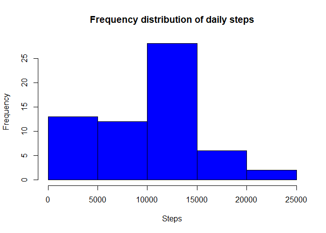
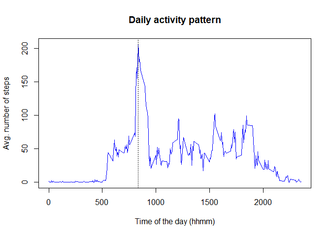
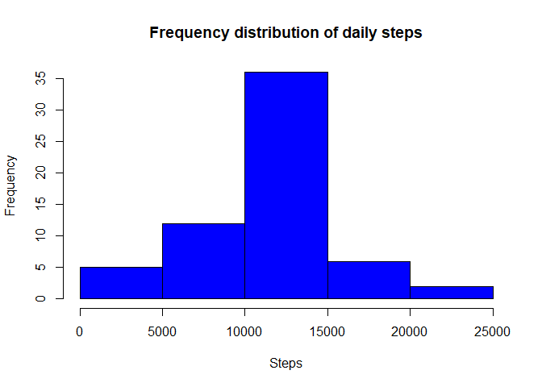
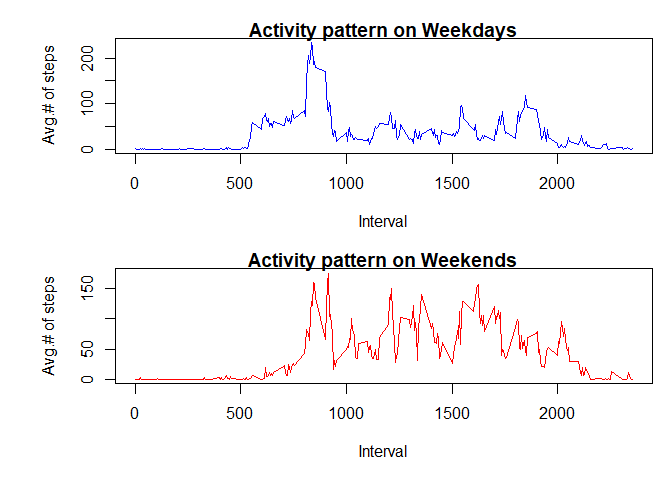

```r
knitr::opts_chunk$set(fig.path='figure/')
```


### Load data and process the Date column


```r
download.file(url = "https://d396qusza40orc.cloudfront.net/repdata%2Fdata%2Factivity.zip", 
              destfile = "repdata_activity.zip")
unzip(zipfile = "repdata_activity.zip", exdir = ".")

activitydata <- read.csv("activity.csv", na.strings = "NA")

activitydata$date <- as.Date(as.character(activitydata$date), "%Y-%m-%d")
```


## 1. What is mean total number of steps taken per day?


```r
dailysteps <- with(activitydata, 
                   aggregate(x=steps, by=list(date), FUN=sum, na.rm=TRUE))

dailymean <- mean(dailysteps$x)
dailymedian <- median(dailysteps$x)

hist(dailysteps$x, 
     xlab = "Steps", main = "Frequency distribution of daily steps", 
     col = "blue")
```

<!-- -->

```r
print(paste("Mean of daily number of steps = ", dailymean))
```

```
## [1] "Mean of daily number of steps =  9354.22950819672"
```

```r
print(paste("Median of daily number of steps = ", dailymedian))
```

```
## [1] "Median of daily number of steps =  10395"
```

## 2. What is the average daily activity pattern?


```r
intervalsteps <- with(activitydata,
                      aggregate(x=steps, by=list(interval), FUN=mean, na.rm=TRUE))
names(intervalsteps) <- c("interval", "avgsteps")
maxinterval <- intervalsteps[intervalsteps$avgsteps==max(intervalsteps$avgsteps),1]

plot(intervalsteps$interval, intervalsteps$avgsteps,
     type="l", col="blue",
     xlab="Time of the day (hhmm)", ylab="Avg. number of steps", 
     main="Daily activity pattern")
abline(v=maxinterval, lty=3)
```

<!-- -->

```r
print(paste("Interval with maximum average number of steps is ", maxinterval))
```

```
## [1] "Interval with maximum average number of steps is  835"
```

## 3. Imputing missing values


```r
narows <- sum(!complete.cases(activitydata))
print(paste("Number of rows with NA values = ", narows))
```

```
## [1] "Number of rows with NA values =  2304"
```

A new data set, which is a replica of the original data set, has been created 
and any missing values have been replaced by average number of steps for the 
corresponging interval. 


```r
activitydataimp <- activitydata
activitydataimp <- merge(activitydataimp, intervalsteps, 
                         by.x = "interval", by.y = "interval")

for (i in 1:nrow(activitydataimp))
{
    if(is.na(activitydataimp$steps[i]))
    {
        activitydataimp[i,"steps"] <- activitydataimp[i, "avgsteps"]
    }
    
}
activitydataimp$avgsteps <- NULL

dailysteps2 <- with(activitydataimp, 
                   aggregate(x=steps, by=list(date), FUN=sum))
hist(dailysteps2$x, 
     xlab = "Steps", main = "Frequency distribution of daily steps", col = "blue")
```

<!-- -->

```r
dailymean2 <- mean(dailysteps2$x)
dailymedian2 <- median(dailysteps2$x)

meanimp <- dailymean2 - dailymean
medimp <- dailymedian2 - dailymedian


cat("Mean of daily number of steps =", dailymean2, "\n", 
    "Median of daily number of steps =", dailymedian2, "\n\n",
    "Due to the imputation of missing values, \n",
    "Mean changed by:", meanimp, "\n",
    "Median changed by:", medimp)
```

```
## Mean of daily number of steps = 10766.19 
##  Median of daily number of steps = 10766.19 
## 
##  Due to the imputation of missing values, 
##  Mean changed by: 1411.959 
##  Median changed by: 371.1887
```

## 4. Are there differences in activity patterns between weekdays and weekends?


```r
wdays <- c("Monday", "Tuesday", "Wednesday", "Thursday", "Friday")
activitydata$day <- factor((weekdays(activitydata$date) %in% wdays), 
         levels=c(FALSE, TRUE), labels=c('weekend', 'weekday')) 

intstepswday <- with(activitydata[activitydata$day=="weekday",],
                      aggregate(x=steps, by=list(interval), FUN=mean, na.rm=TRUE))
intstepswend <- with(activitydata[activitydata$day=="weekend",],
                      aggregate(x=steps, by=list(interval), FUN=mean, na.rm=TRUE))


names(intstepswday) <- c("interval", "avgsteps")
names(intstepswend) <- c("interval", "avgsteps")

par(mfrow=c(2,1), mar=c(5,5,1,1), oma=c(0,1,1,0))
with(intstepswday, plot(interval, avgsteps, 
                        xlab = "Interval", ylab = "Avg.# of steps", 
                        main = "Activity pattern on Weekdays",
                        type ="l", col="blue"))
with(intstepswend, plot(interval, avgsteps, 
                        xlab = "Interval", ylab = "Avg.# of steps",
                        main = "Activity pattern on Weekends", 
                        type="l", col="red"))
```

<!-- -->
